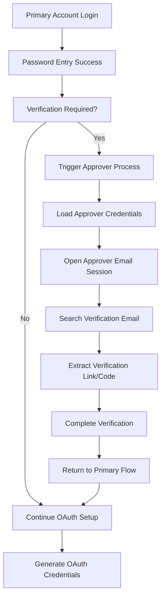

# Gmail OAuth Approver Email Feature - Technical Requirements Document

## 1. Product Overview

This document outlines the technical requirements for adding approver email account functionality to the Gmail OAuth automation system. The current system fails at login verification after password entry, requiring manual intervention. This enhancement will enable automatic verification completion through designated approver email accounts.

The feature addresses the critical bottleneck where Google requires additional verification steps (email verification, 2FA confirmation) that currently cause automation failures with 0% success rate.

## 2. Core Features

### 2.1 User Roles

| Role | Registration Method | Core Permissions |
|------|---------------------|------------------|
| Primary Account | CSV/Manual input with email and password | Target account for OAuth setup |
| Approver Account | Configuration file with email and password | Can access verification emails and approve login attempts |
| System Administrator | Configuration access | Can configure approver accounts and verification settings |

### 2.2 Feature Module

Our approver email integration consists of the following main components:

1. **Verification Detection Page**: Enhanced challenge detection, approver account triggering, verification email monitoring.
2. **Approver Email Handler**: Email access automation, verification link detection, automatic approval processing.
3. **Configuration Management**: Approver account setup, verification timeout settings, retry logic configuration.
4. **Integration Layer**: Seamless integration with existing OAuth flow, fallback mechanisms, error handling.

### 2.3 Page Details

| Page Name | Module Name | Feature description |
|-----------|-------------|---------------------|
| Verification Detection | Enhanced Challenge Detection | Detect email verification requirements, identify verification type (email/2FA), trigger approver account process |
| Verification Detection | Approver Account Triggering | Load approver account credentials, initiate parallel verification session, coordinate with main OAuth flow |
| Approver Email Handler | Email Access Automation | Login to approver email account, navigate to inbox, search for verification emails |
| Approver Email Handler | Verification Link Detection | Parse verification emails, extract verification links/codes, validate verification content |
| Approver Email Handler | Automatic Approval | Click verification links, enter verification codes, complete approval process |
| Configuration Management | Approver Account Setup | Configure approver email credentials, set verification timeouts, define retry parameters |
| Configuration Management | Verification Settings | Configure email search patterns, verification link patterns, timeout settings |
| Integration Layer | OAuth Flow Integration | Seamlessly integrate with existing login flow, maintain session state, handle parallel processing |
| Integration Layer | Error Handling | Implement fallback mechanisms, handle approver account failures, provide detailed logging |

## 3. Core Process

### Primary Account Flow
1. User initiates OAuth setup for primary account
2. System enters email and password successfully
3. Google requires additional verification (email/2FA)
4. System detects verification requirement
5. System triggers approver email process
6. Approver account accesses verification email
7. Verification is completed automatically
8. Primary account OAuth setup continues
9. OAuth credentials are generated successfully

### Approver Account Flow
1. System detects verification requirement for primary account
2. Load configured approver account credentials
3. Open new browser session for approver account
4. Login to approver email account
5. Search for verification email from Google
6. Extract verification link or code
7. Complete verification process
8. Return control to primary account flow

## 4. User Interface Design

### 4.1 Design Style

- **Primary Colors**: Blue (#1976D2) for primary actions, Green (#4CAF50) for success states
- **Secondary Colors**: Orange (#FF9800) for warnings, Red (#F44336) for errors
- **Button Style**: Rounded corners with subtle shadows, consistent with existing UI
- **Font**: Segoe UI, 10pt for body text, 12pt for headers
- **Layout Style**: Tab-based interface with clear section separation
- **Icons**: Material Design icons for consistency

### 4.2 Page Design Overview

| Page Name | Module Name | UI Elements |
|-----------|-------------|-------------|
| Configuration Tab | Approver Account Setup | Input fields for approver email/password, validation indicators, test connection button |
| Configuration Tab | Verification Settings | Timeout sliders, retry count spinners, pattern configuration text areas |
| Main Processing | Verification Status | Real-time status indicators, progress bars, detailed logging area |
| Main Processing | Approver Activity | Secondary window showing approver email session, verification progress |

### 4.3 Responsiveness

The feature maintains desktop-first design consistent with the existing application. No mobile optimization required as this is a desktop automation tool.