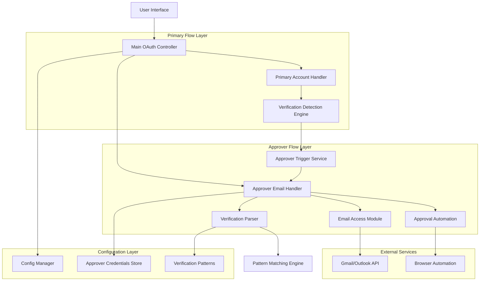
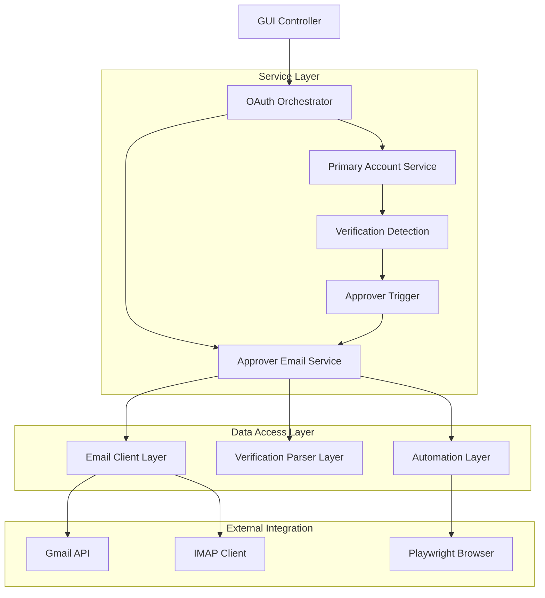
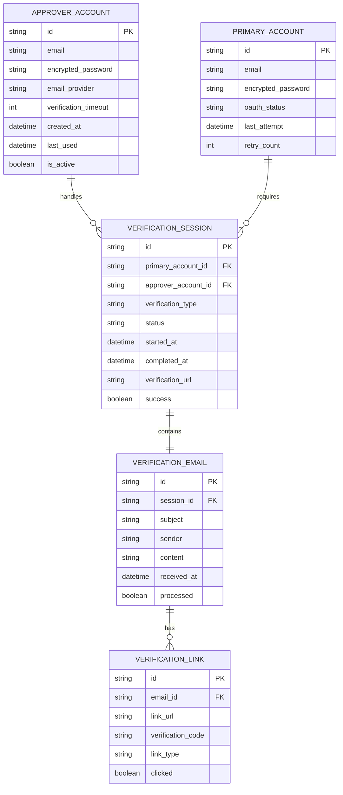

# Gmail OAuth Approver Email Feature - Technical Architecture Document

## 1. Architecture Design



## 2. Technology Description

- **Frontend**: Python Tkinter GUI (existing) + enhanced configuration panels
- **Backend**: Python asyncio-based automation with Playwright
- **Email Access**: IMAP/POP3 clients + Gmail API integration
- **Browser Automation**: Playwright with enhanced session management
- **Configuration**: JSON-based configuration with encrypted credential storage

## 3. Route Definitions

| Route | Purpose |
|-------|---------|
| /config/approver | Approver account configuration interface |
| /verification/detect | Real-time verification detection endpoint |
| /approver/trigger | Approver email process initiation |
| /approver/status | Approver process status monitoring |
| /verification/complete | Verification completion callback |

## 4. API Definitions

### 4.1 Core API

**Approver Account Configuration**
```
POST /api/approver/configure
```

Request:
| Param Name | Param Type | isRequired | Description |
|------------|------------|------------|-------------|
| email | string | true | Approver email address |
| password | string | true | Approver email password |
| email_provider | string | true | Email provider (gmail, outlook, etc.) |
| verification_timeout | integer | false | Timeout in seconds (default: 300) |

Response:
| Param Name | Param Type | Description |
|------------|------------|-------------|
| success | boolean | Configuration status |
| test_result | object | Connection test results |

Example:
```json
{
  "email": "approver@example.com",
  "password": "encrypted_password",
  "email_provider": "gmail",
  "verification_timeout": 300
}
```

**Verification Detection**
```
POST /api/verification/detect
```

Request:
| Param Name | Param Type | isRequired | Description |
|------------|------------|------------|-------------|
| primary_email | string | true | Primary account email |
| current_url | string | true | Current browser URL |
| page_content | string | true | Page content for analysis |

Response:
| Param Name | Param Type | Description |
|------------|------------|-------------|
| verification_required | boolean | Whether verification is needed |
| verification_type | string | Type of verification (email, 2fa, etc.) |
| approver_triggered | boolean | Whether approver process was started |

**Approver Process Status**
```
GET /api/approver/status/{session_id}
```

Response:
| Param Name | Param Type | Description |
|------------|------------|-------------|
| status | string | Current status (searching, found, completing, done) |
| progress | integer | Progress percentage |
| verification_found | boolean | Whether verification email was found |
| completion_status | string | Verification completion status |

## 5. Server Architecture Diagram



## 6. Data Model

### 6.1 Data Model Definition



### 6.2 Data Definition Language

**Approver Account Table**
```sql
-- Create approver accounts table
CREATE TABLE approver_accounts (
    id VARCHAR(36) PRIMARY KEY DEFAULT (UUID()),
    email VARCHAR(255) UNIQUE NOT NULL,
    encrypted_password TEXT NOT NULL,
    email_provider VARCHAR(50) NOT NULL CHECK (email_provider IN ('gmail', 'outlook', 'yahoo', 'custom')),
    verification_timeout INTEGER DEFAULT 300,
    created_at TIMESTAMP DEFAULT CURRENT_TIMESTAMP,
    last_used TIMESTAMP NULL,
    is_active BOOLEAN DEFAULT TRUE
);

-- Create verification sessions table
CREATE TABLE verification_sessions (
    id VARCHAR(36) PRIMARY KEY DEFAULT (UUID()),
    primary_account_id VARCHAR(36) NOT NULL,
    approver_account_id VARCHAR(36) NOT NULL,
    verification_type VARCHAR(50) NOT NULL,
    status VARCHAR(50) DEFAULT 'pending' CHECK (status IN ('pending', 'searching', 'found', 'completing', 'completed', 'failed')),
    started_at TIMESTAMP DEFAULT CURRENT_TIMESTAMP,
    completed_at TIMESTAMP NULL,
    verification_url TEXT NULL,
    success BOOLEAN DEFAULT FALSE,
    error_message TEXT NULL,
    FOREIGN KEY (approver_account_id) REFERENCES approver_accounts(id)
);

-- Create verification emails table
CREATE TABLE verification_emails (
    id VARCHAR(36) PRIMARY KEY DEFAULT (UUID()),
    session_id VARCHAR(36) NOT NULL,
    subject VARCHAR(500) NOT NULL,
    sender VARCHAR(255) NOT NULL,
    content TEXT NOT NULL,
    received_at TIMESTAMP DEFAULT CURRENT_TIMESTAMP,
    processed BOOLEAN DEFAULT FALSE,
    FOREIGN KEY (session_id) REFERENCES verification_sessions(id)
);

-- Create verification links table
CREATE TABLE verification_links (
    id VARCHAR(36) PRIMARY KEY DEFAULT (UUID()),
    email_id VARCHAR(36) NOT NULL,
    link_url TEXT NOT NULL,
    verification_code VARCHAR(100) NULL,
    link_type VARCHAR(50) NOT NULL CHECK (link_type IN ('verification', 'approval', '2fa', 'security')),
    clicked BOOLEAN DEFAULT FALSE,
    clicked_at TIMESTAMP NULL,
    FOREIGN KEY (email_id) REFERENCES verification_emails(id)
);

-- Create indexes for performance
CREATE INDEX idx_verification_sessions_primary_account ON verification_sessions(primary_account_id);
CREATE INDEX idx_verification_sessions_status ON verification_sessions(status);
CREATE INDEX idx_verification_emails_session ON verification_emails(session_id);
CREATE INDEX idx_verification_emails_received ON verification_emails(received_at DESC);
CREATE INDEX idx_verification_links_email ON verification_links(email_id);

-- Insert initial configuration data
INSERT INTO approver_accounts (email, encrypted_password, email_provider, verification_timeout) VALUES
('approver@example.com', 'encrypted_password_here', 'gmail', 300);
```

**Configuration Schema**
```json
{
  "approver_accounts": [
    {
      "id": "uuid",
      "email": "approver@example.com",
      "password": "encrypted_password",
      "provider": "gmail",
      "timeout": 300,
      "active": true
    }
  ],
  "verification_patterns": {
    "email_subjects": [
      "Google Account verification",
      "Verify your Google Account",
      "Security alert for your Google Account"
    ],
    "link_patterns": [
      "accounts.google.com/signin/challenge",
      "accounts.google.com/verification",
      "myaccount.google.com/verify"
    ],
    "code_patterns": [
      "\\b\\d{6}\\b",
      "verification code: (\\d+)",
      "code is (\\d+)"
    ]
  },
  "automation_settings": {
    "max_email_search_time": 300,
    "email_check_interval": 10,
    "max_verification_attempts": 3,
    "browser_timeout": 60
  }
}
```